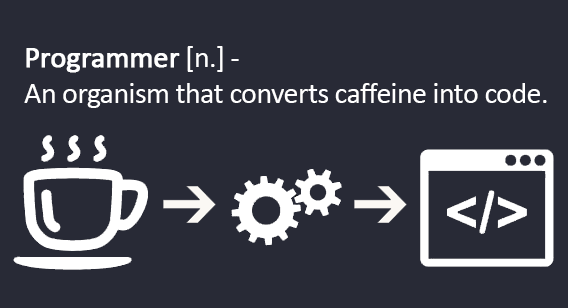

  

## About Me 💁‍♂️

My name is Noam Levi, I'm a software engineer, a developer and a gamer at heart.  
You're welcome to explore my profile and projects.

For my resume, [click here](https://drive.google.com/file/d/1tCOA-ZcDMRNccePv69f9NoGI1jPZSqLz/view?usp=sharing).

## Projects 

* MagicDex - A project about auto-detecting physical mtg card shown via live video feed, uploading detected cards to a DB and managing user's collection.  
  Using OpenCV, MongoDB, PyQt, React, Flask and many more technologies.
  * [MagicDex Desktop](https://github.com/LooLzzz/magicdex-desktop)
  * [MagicDex Web](https://github.com/LooLzzz/magicdex-web)
  * [MagicDex Server](https://github.com/LooLzzz/magicdex-server)
* Draftsim - A MERN based webapp about mtg draft/sealed simulations.  
  * [Link](https://github.com/LooLzzz/mtg-draftsim)
* Parallel implimention of sequence alignment score using cuda+omp+mpi.
  * [Link](https://github.com/LooLzzz/parallel-sequence-alignment-score)

## Tech 🔧

### Languages and Tools 🍕

### Softwares and IDEs 🧾

## Socials 🔗

---

  

